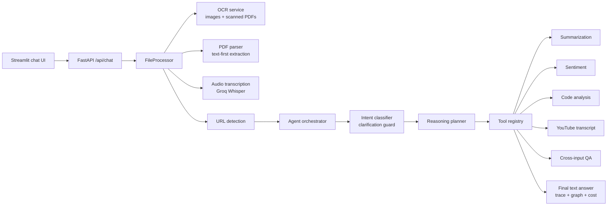

# Agentic Multimodal AI Application

Production-ready FastAPI + Streamlit system for multimodal document reasoning with Groq.

## Features

- Text prompt plus multi-file upload.
- Image OCR with Tesseract.
- PDF text extraction with scanned-PDF OCR fallback.
- Audio speech-to-text through Groq Whisper.
- URL detection across prompts and extracted documents.
- YouTube transcript extraction when YouTube URLs are found.
- Autonomous agent layer for intent classification, tool selection, planning, and cross-input synthesis.
- Tools for summarization, sentiment analysis, code explanation and bug detection, YouTube transcripts, and general QA.
- Structured response with final answer, extracted text, step-by-step tool trace, cost estimate, and visual execution graph.
- Dockerized deployment with Render blueprint.

## Architecture



```text
frontend/
  app.py                         Streamlit chat UI
backend/
  app/main.py                    FastAPI API and streaming endpoint
  app/services/                  OCR, PDF, audio, URL, file processing
  app/agent/                     intent classifier, planner, orchestrator
  app/tools/                     tool registry and tool implementations
  app/providers/groq_client.py   Groq chat and audio client
  tests/                         unit tests
```

The request flow is:

```text
Upload/message -> FileProcessor -> OCR/PDF/Audio services -> URL detection
-> IntentClassifier -> ReasoningPlanner -> ToolRegistry -> final synthesis
-> API response with extracted text, trace, graph, and cost estimate
```

## Requirement Coverage

| Requirement | Status |
| --- | --- |
| Text, image, PDF, audio, multi-file inputs | Implemented |
| Image OCR and scanned-PDF OCR fallback | Implemented with OCR confidence metadata when available |
| Audio speech-to-text | Implemented through Groq Whisper with duration metadata when detectable |
| URL detection inside documents | Implemented |
| YouTube transcript fetching | Implemented with failure reporting |
| Intent classification, planning, tool selection, cross-input reasoning | Implemented |
| Mandatory clarification on missing goal | Implemented for empty/unclear goal cases before tool execution |
| Summarization | Returns 1-line summary, 3 bullets, and 5-sentence summary |
| Sentiment analysis | Returns label, confidence, and justification via the sentiment tool |
| Code explanation | Explains behavior, likely bugs/risks, and complexity |
| Output includes final answer, extracted text, and tool trace | Implemented |
| Cost estimate and execution graph | Implemented |
| Docker and Render deployment config | Implemented |
| Public live URL | Requires deployment from your Render/cloud account |

## Environment

Create `.env` from `.env.example`:

```bash
GROQ_API_KEY=your_groq_api_key_here
GROQ_CHAT_MODEL=llama-3.3-70b-versatile
GROQ_AUDIO_MODEL=whisper-large-v3-turbo
API_BASE_URL=http://127.0.0.1:8000
```

For OCR on your host machine, install the Tesseract binary and ensure it is on `PATH`. Docker installs it automatically.

## Local Development

Backend:

```bash
cd backend
python -m venv .venv
.venv\Scripts\activate
pip install -r requirements.txt
uvicorn app.main:app --reload --port 8000
```

Frontend:

```bash
cd frontend
pip install -r requirements.txt
streamlit run app.py
```

Open Streamlit at `http://localhost:8501`.

## Docker

```bash
docker compose up --build
```

Then open `http://localhost:8501`. The FastAPI backend is available at `http://localhost:8000`.

## API

Health:

```bash
curl http://localhost:8000/health
```

Chat:

```bash
curl -X POST http://localhost:8000/api/chat \
  -F "message=Summarize this in 3 bullets" \
  -F "files=@sample.pdf"
```

Streaming endpoint:

```bash
curl -N -X POST http://localhost:8000/api/chat/stream \
  -F "message=Analyze all uploaded files"
```

## Deployment

This repo includes `Dockerfile` and `render.yaml` for Render.

1. Push the repository to GitHub.
2. Create a new Render Blueprint from `render.yaml`.
3. Add `GROQ_API_KEY` in Render environment variables.
4. Deploy.

Live URL: add the Render service URL here after deployment.

I cannot create the public deployment from this local workspace without access to your Render, GitHub, or Streamlit Cloud account, but the Dockerfile and Render blueprint are included so the app is ready to deploy.

## Example Test Cases

```bash
cd backend
pytest
```

Covered examples:

- URL detection and YouTube URL recognition.
- Text file processing with extracted URLs.
- PDF routing to the PDF service.
- Planner ordering for YouTube transcript plus summarization.
- OCR confidence metadata for images.
- Audio duration metadata.
- Mandatory clarification when no task is provided.
- Summary tool prompt shape for 1-line, 3-bullet, and 5-sentence summaries.

Manual scenarios to test in the UI:

- Upload an image with visible text and ask for a one-line summary.
- Upload a scanned PDF and ask for key decisions.
- Upload audio and ask for sentiment plus action items.
- Upload multiple text/code files and ask for cross-file bugs and complexity.
- Paste a YouTube URL and ask for the transcript or summary.
